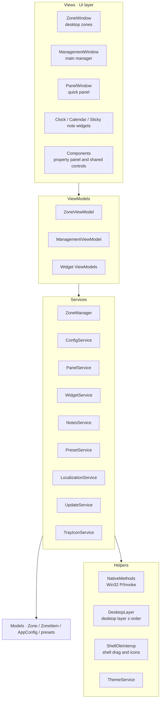

[简体中文](README.md) | **English**

<div align="center">
  

  <h1>DeskOrder</h1>

  <p><strong>Desktop organization and tile beautification, in one app</strong></p>

  <p>
    <a href="https://github.com/Three-Freezen/DeskOrder/releases/latest"></a>
    <a href="https://github.com/Three-Freezen/DeskOrder/releases"></a>
    <a href="LICENSE"></a>
    
    
    <!-- TODO: point this badge to the website once it is live -->
    <a href="#"></a>
  </p>
</div>


---

## About

A messy desktop needs organizing; a plain desktop could look better. That used to mean two different tools. DeskOrder does both: zones keep your icons tidy, while tiles, liquid glass and widgets make the desktop look the way you want.

- Desktop organization and tile beautification in one app
- Every style is tunable — save it as a preset card and apply it anywhere with one click
- Icons are just references to the original file paths — files never move, and deleting an icon never touches the file

## Screenshots


## Download & Install

Requirements: Windows 10 or later, 64-bit. The app ships with its own runtime — no .NET installation needed.

Two packages are available:

- **Installer** DeskOrder-win-Setup.exe: setup wizard, with in-app upgrades afterwards
- **Portable** DeskOrder-win-Portable.zip: unzip and run

Command-line download (PowerShell, always fetches the latest release):

```powershell
# Installer
irm https://github.com/Three-Freezen/DeskOrder/releases/latest/download/DeskOrder-win-Setup.exe -OutFile DeskOrder-win-Setup.exe

# Or portable
irm https://github.com/Three-Freezen/DeskOrder/releases/latest/download/DeskOrder-win-Portable.zip -OutFile DeskOrder-win-Portable.zip
```

You can also grab them from the [Releases page](https://github.com/Three-Freezen/DeskOrder/releases).

Updates: open Settings → Check for updates. The app downloads, installs and restarts automatically; your configuration is preserved.

## Features

### Zones (desktop organization)

- Any number of transparent floating zones; resize from any corner, drag by the title bar, multi-monitor support
- Drop files or folders in to organize them; click-to-import also supported. System locations such as Recycle Bin and Control Panel go through the "Import system items" dialog
- Context menu: open, show location, rename, delete
- Icon grid or free layout — grid size is icon size; snap to grid and auto-arrange on resize
- **Icons link straight to the original files**: an icon is only a reference — nothing is copied or moved, and removing the icon leaves the file in place
- Folder mapping: map any folder or drive into a zone; changes made in the zone sync back to the folder
- Auto-organize: watch a folder and route new files into a zone by extension or filename keyword, or scan and organize existing files with your chosen folder and filters in one go
- Three states: show / minimize / fully hide; double-click the desktop to show or hide all zones (optional)

### Tiles & styling

- Tile mode: turn a zone into one big tile with the title bar hidden; enable a custom icon to make the whole tile a single launcher
- Liquid glass: adjustable blur, tint opacity and luminosity
- Background image: custom picture with opacity, crop, offset and zoom
- **Custom preset cards**: save a whole style as a card, then apply it to other zones, panels and widgets — no repeated tweaking

### Widgets

- Clock: analog / digital, 12 / 24-hour, second-hand color
- Calendar: to-do reminders via tray notifications
- Sticky notes: bind a global hotkey to each note

### Quick panel

Summoned with a global hotkey; keeps all zone cards in one place, with file search, new document/folder creation and system item import. Popup position and motion are configurable.

### Merged groups

Combine zones into a group and restyle them together.

### System integration

- Zones live on the desktop layer: above the wallpaper, below normal app windows
- System tray, start with Windows
- English / Chinese UI, applies instantly
- Light / dark theme
- In-app updates

## Highlights

### Organization and beautification in one app

Zones keep things tidy; tiles and widgets make it look good. No second tool, no syncing two configs.

### Deeply customizable — set it once

Every part can be tuned:

| Aspect | Options |
|---|---|
| Border | color, opacity, thickness |
| Fill | color, opacity; title bar can be set independently |
| Title bar | color, opacity, name color |
| Material | liquid glass (blur, tint, luminosity) |
| Background | image, opacity, crop, offset, zoom |
| Icons | emoji icons, icon color, custom tile icon |
| Content | body color, button color, per-element opacity |
| Layout | grid size, snap to grid, free layout, auto-arrange |
| Shape | rounded / sharp corners, any size |
| Motion | motion settings, hover-expand animation |
| Presets | custom preset cards, 9-color presets, built-in color picker |

Save the whole look as a preset card and apply it to the next zone with one click. Tune it once, reuse it everywhere.

### Icons link to the real files — nothing to break

Zone icons are references to file paths: files stay where they are; DeskOrder never copies, moves or renames them. Removing an icon removes only the reference. Together with folder mapping and auto-organize, no organizing action ever touches the files themselves.

### Also

- Self-contained build — works with or without a system .NET
- Memory and rendering performance optimized
- Configuration stays local; nothing is uploaded
- MIT licensed

## Architecture

| | |
|---|---|
| Language / runtime | C#, .NET 10 (self-contained) |
| UI framework | WPF |
| System integration | Win32 P/Invoke |
| Config storage | JSON (%APPDATA%\DesktopZones) |
| Packaging / release | Inno Setup + GitHub Actions |



Implementation notes:

- Desktop-layer strategy: zones and widgets stay above the wallpaper and below normal app windows, falling back after drag or bring-to-front
- Shell integration: icon extraction, OLE drag & drop, shortcut resolution
- Config I/O: in-memory cache + atomic writes, so the config file never gets corrupted
- Localization: i18n JSON resources; switching the UI language applies immediately

## Building from Source

```bash
git clone https://github.com/Three-Freezen/DeskOrder.git
cd DeskOrder
dotnet build

# Run locally
dotnet run
```

Publish a single directory:

```bash
dotnet publish DesktopZones.csproj -c Release -r win-x64 --self-contained
```

Use `tools/pack.ps1` to build the installer and portable zip (requires [Inno Setup 6](https://jrsoftware.org/isinfo.php)). Official releases are built automatically by GitHub Actions and uploaded to Releases.

## Future Plans

- Media playback display widget
- List mode for zones
- Performance optimizations

Release notes: [Releases](https://github.com/Three-Freezen/DeskOrder/releases).

## License

[MIT License](LICENSE) · Three-Freeze
