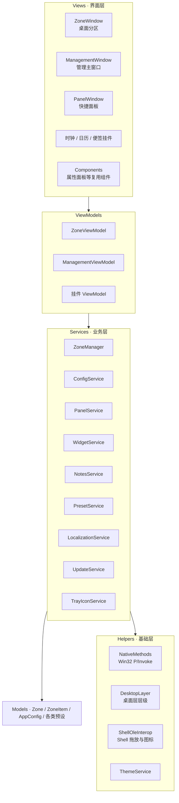

**简体中文** | [English](README.en.md)

<div align="center">
  

  <h1>DeskOrder 秩序桌面</h1>

  <p><strong>桌面分类管理和磁贴美化，一个软件全实现</strong></p>

  <p>
    <a href="https://github.com/Three-Freezen/DeskOrder/releases/latest"></a>
    <a href="https://github.com/Three-Freezen/DeskOrder/releases"></a>
    <a href="LICENSE"></a>
    
    
    <!-- TODO: 官网上线后，把下面徽章的 href="#" 换成官网地址 -->
    <a href="#"></a>
  </p>
</div>


---

## 简介

桌面图标太乱，想分类收纳；又想让桌面好看一点。这两件事通常要装两个工具。DeskOrder 把它们做在了一起：用分区把图标收整齐，用磁贴、液态玻璃和挂件把桌面排成想要的样子。

- 分类管理和磁贴美化，二合一
- 样式全都能改，改好存成预设卡，别的分区一键套用
- 图标只记录文件原路径，文件不搬家，删图标不动文件

## 效果预览


## 下载与安装

系统要求：Windows 10 及以上，64 位。软件自带运行时，不需要另外安装 .NET。

提供两种包：

- **安装版** DeskOrder-win-Setup.exe：向导安装，之后可在设置里一键升级
- **便携版** DeskOrder-win-Portable.zip：解压即用

命令行下载（PowerShell，直接拉取最新版）：

```powershell
# 安装版
irm https://github.com/Three-Freezen/DeskOrder/releases/latest/download/DeskOrder-win-Setup.exe -OutFile DeskOrder-win-Setup.exe

# 或便携版
irm https://github.com/Three-Freezen/DeskOrder/releases/latest/download/DeskOrder-win-Portable.zip -OutFile DeskOrder-win-Portable.zip
```

也可以到 [Releases 页面](https://github.com/Three-Freezen/DeskOrder/releases)手动下载。

升级：打开「设置 → 检查更新」，下载完成后自动重启安装，配置不会丢。

## 软件功能

### 桌面分区（分类管理）

- 任意数量的透明悬浮分区，四角缩放、标题栏拖动、多显示器支持
- 文件、文件夹拖进来就归类，也支持点击导入；回收站、控制面板这类系统级项目，通过右键「导入系统项目」窗口选择导入
- 右键菜单：打开、打开位置、重命名、删除
- 图标网格或自由排列，网格大小就是图标大小；支持吸附网格、尺寸变化自动重排
- **文件直连原路径**：图标只是原文件的引用，不复制、不移动；删掉图标，文件还在原处
- 文件夹映射：把电脑里的某个文件夹或磁盘映射进分区展示，在分区里做的操作会同步到原文件夹
- 自动整理：监听指定文件夹，按扩展名或文件名关键字，新文件自动归入分区；也可以选定文件夹和筛选条件，一键扫描把已有文件整理进分区
- 三态开关：显示 / 最小化 / 彻底隐藏；双击桌面可以一键显示或隐藏全部分区（可关闭）

### 磁贴与美化

- 磁贴模式：分区变成一块大磁贴（标题栏隐藏），可再开启自定义图标——整个分区只放一个图标，双击即打开对应文件
- 液态玻璃：模糊量、着色透明度、光度可调
- 背景图：自定义图片，透明度、裁剪、偏移、缩放都能调
- **自定义预设卡**：把调好的整套样式存成卡片，其他分区、面板、挂件直接套用，不用一项项重设

### 桌面挂件

- 时钟：指针 / 数字两种模式，12 / 24 小时制，秒针颜色也能换
- 日历：待办提醒，到点通过托盘通知
- 便签：每张便签可绑定全局热键，随时唤起

### 快捷面板

全局热键呼出，全部分区卡片收纳在一处；内置文件搜索、新建文档和文件夹、导入系统项目。弹出位置和动效可调。

### 合并组

多个分区组成一组统一管理，样式一起换。

### 系统集成

- 分区驻留桌面层：在壁纸之上、普通应用窗口之下，不挡应用
- 系统托盘、开机自启
- 中英双语，切换即时生效
- 浅色 / 深色主题
- 应用内更新

## 软件特色

### 分类管理和磁贴美化，二合一

分区负责把东西收整齐，磁贴和挂件负责好看。不用一边装整理工具、一边装美化工具，也不用来回同步两套配置。

### 自定义程度高，还不用反复调

从边框、填充、标题栏到背景、材质、动效，每个部分都能改：

| 维度 | 可调项 |
|---|---|
| 边框 | 颜色、透明度、粗细 |
| 填充 | 内部填充颜色、透明度，标题栏可单独设置 |
| 标题栏 | 颜色、透明度、名称颜色 |
| 材质 | 液态玻璃（模糊量、着色、光度） |
| 背景 | 图片、透明度、裁剪、偏移、缩放 |
| 图标 | Emoji 图标、图标颜色、磁贴自定义图标 |
| 内容 | 主体内容颜色、按钮颜色、各元素透明度 |
| 布局 | 网格大小、吸附网格、自由排列、自动重排 |
| 形状 | 圆角 / 尖角、任意尺寸 |
| 动效 | 动效设置、悬停展开动画 |
| 预设 | 自定义预设卡、九色统一预设、内置取色器 |

调满意的整套样式存成预设卡，换个分区一键套上。第一次调麻烦一点，之后不用重来。

### 图标直连原文件，删了也不怕

分区里的图标只是文件路径的引用：文件始终在原位，DeskOrder 不复制、不移动、不改名；删图标只是去掉引用，原文件好好的。配合文件夹映射和自动整理，所有整理动作都不碰文件本体。

### 其他

- 自包含发布，不依赖系统里装没装 .NET
- 内存和渲染做过专项优化
- 配置全部存本地，不上传数据
- MIT 开源

## 技术架构

| 项目 | 说明 |
|---|---|
| 语言 / 运行时 | C#，.NET 10（自包含发布） |
| 界面框架 | WPF |
| 系统集成 | Win32 P/Invoke |
| 配置存储 | JSON（%APPDATA%\DesktopZones） |
| 打包 / 发布 | Inno Setup + GitHub Actions |



几个关键实现：

- 桌面层层级策略：分区和挂件固定在壁纸之上、应用窗口之下，置顶、拖拽结束后自动回落
- Shell 集成：图标提取、OLE 拖放、快捷方式解析
- 配置读写：内存缓存 + 原子写入，避免写坏配置文件
- 本地化：i18n JSON 资源，界面语言切换即时生效

## 从源码构建

```bash
git clone https://github.com/Three-Freezen/DeskOrder.git
cd DeskOrder
dotnet build

# 本地运行
dotnet run
```

发布单目录：

```bash
dotnet publish DesktopZones.csproj -c Release -r win-x64 --self-contained
```

打包安装器和便携版用 `tools/pack.ps1`（需要先装 [Inno Setup 6](https://jrsoftware.org/isinfo.php)）。正式发布由 GitHub Actions 自动完成，产物上传到 Releases。

## 路线图

吸附对齐、撤销 / 重做、分区布局方案一键切换、分区分享导出等在计划中，详见 [ROADMAP.md](ROADMAP.md)。更新记录见 [Releases](https://github.com/Three-Freezen/DeskOrder/releases)。

## 许可证

[MIT License](LICENSE) · Three-Freeze
