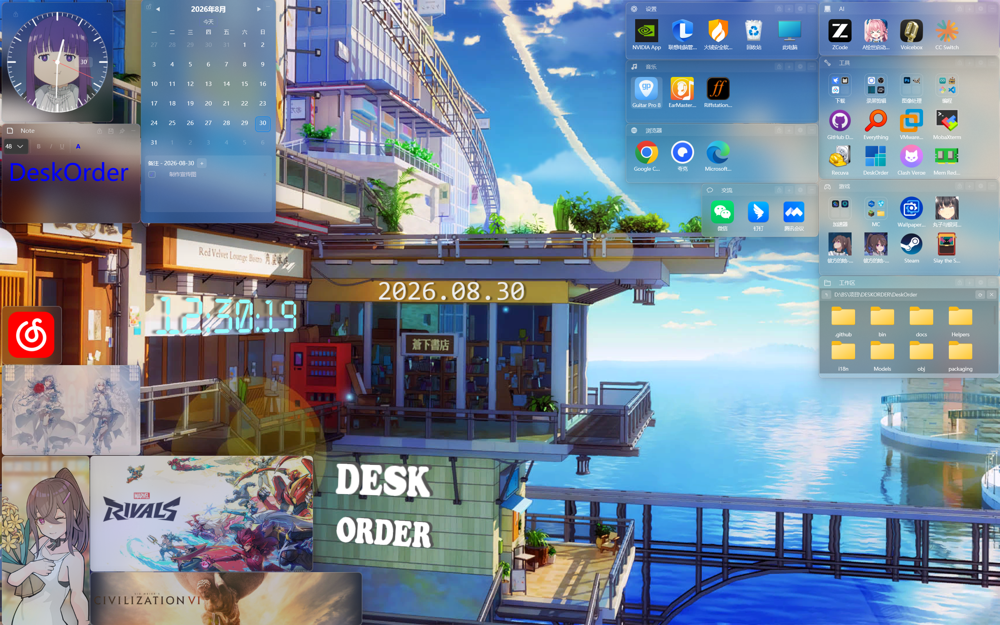
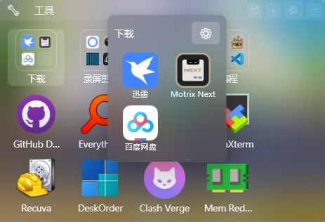
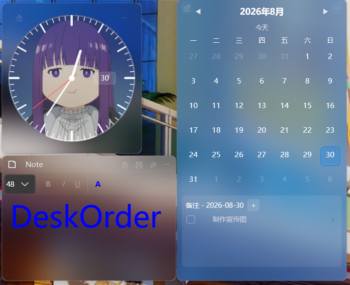
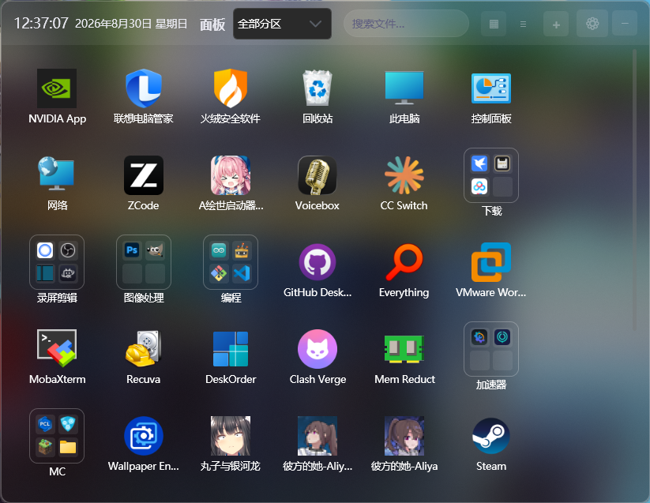
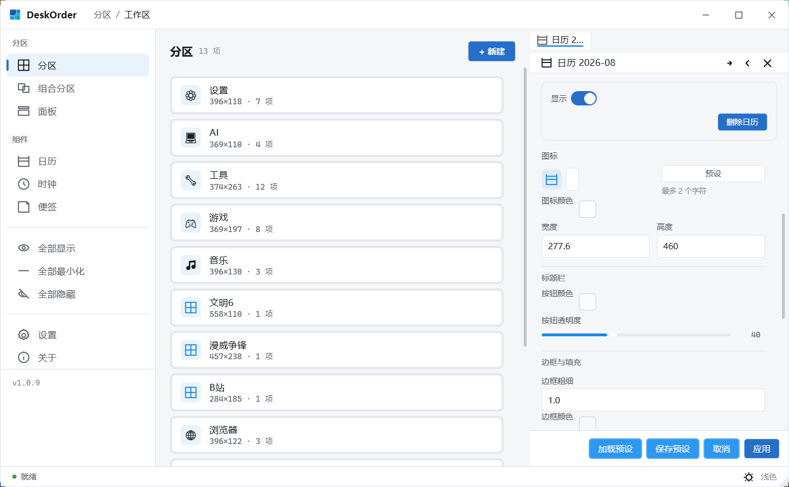

# DeskOrder 秩序桌面

**桌面分类管理和磁贴美化，一个软件全实现**

DeskOrder 用"分区"重新整理你的桌面：把文件、文件夹、快捷方式拖进透明悬浮分区归类收纳，再把分区调成磁贴、加上液态玻璃和挂件，让桌面又整齐又好看。

- 类别：个性化 / 实用工具
- 系统要求：Windows 10 及以上（x64），自带运行时，无需安装 .NET
- 价格：免费，MIT 开源

## 软件截图

## 功能特色

**分区收纳，桌面不再乱**
任意数量的透明悬浮分区，文件拖进来就归类；支持文件夹映射（分区里的操作同步回原文件夹）、自动整理（按扩展名或文件名关键字，新文件自动归入分区）；三态开关显示 / 最小化 / 彻底隐藏，双击桌面一键切换全部。

**磁贴模式，桌面颜值担当**
分区可以变成一块大磁贴：只放一个图标，双击直达，配合液态玻璃、背景图和圆角，排出一面属于你的磁贴墙。

**样式随心改，预设一键套**
边框、填充、标题栏、背景图、材质、动效、布局，每一处都能调；调满意的整套样式存成预设卡，其他分区、面板、挂件一键套用，不用反复设置。

**时钟、日历、便签挂件**
指针 / 数字时钟、带待办提醒的日历、全局热键呼出的便签，桌面即工作台。

**快捷面板**
热键一键呼出：全部分区卡片、文件搜索、快速新建文档和文件夹，收在一个面板里。

**文件直连原路径，删了也不怕**
分区里的图标只是原文件的引用：文件始终在原位，不复制、不移动、不改名；删图标只是去掉引用，原文件好好的。

**贴心细节**
分区驻留桌面层，不遮挡任何应用窗口；系统托盘、开机自启、中英双语、浅色 / 深色主题、应用内更新。

## 相关链接

- GitHub 开源仓库：<https://github.com/Three-Freezen/DeskOrder>
- 官网：<!-- TODO: 官网上线后替换 --> 待上线
